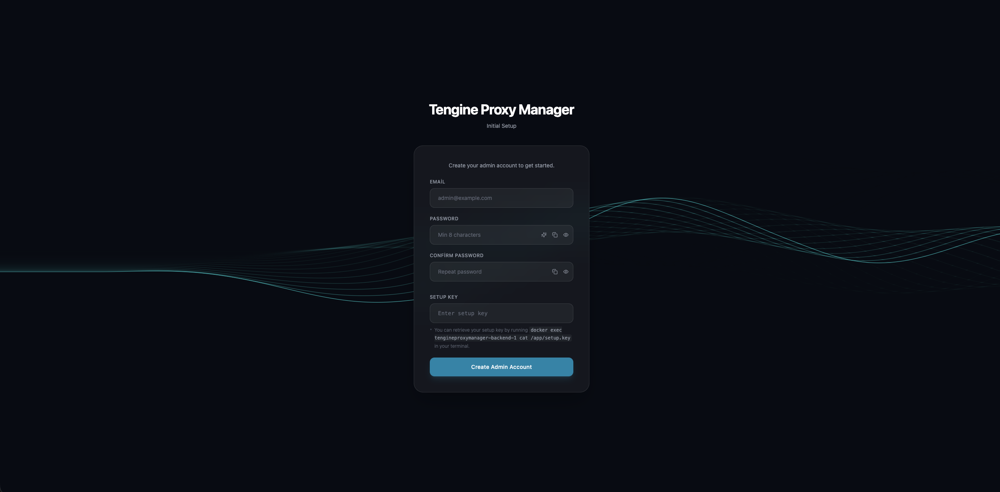
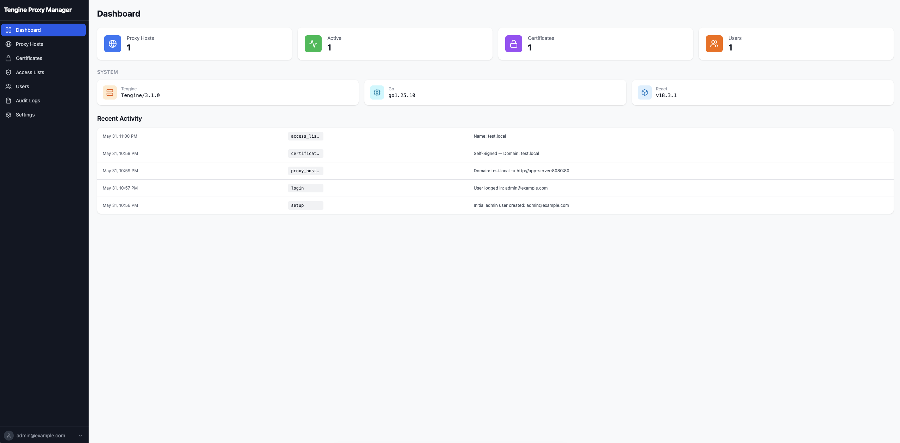
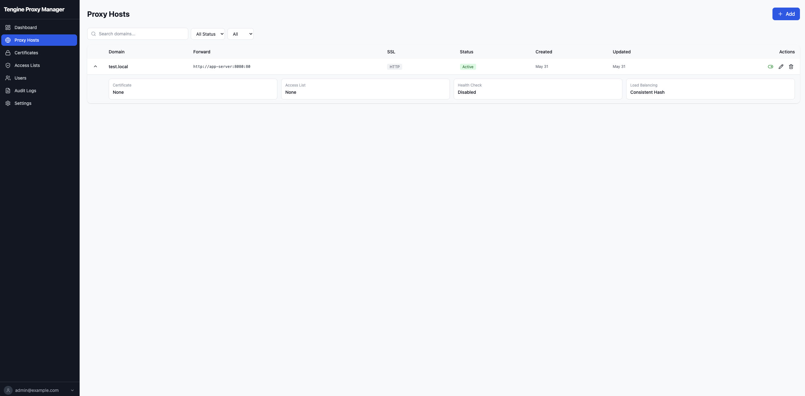
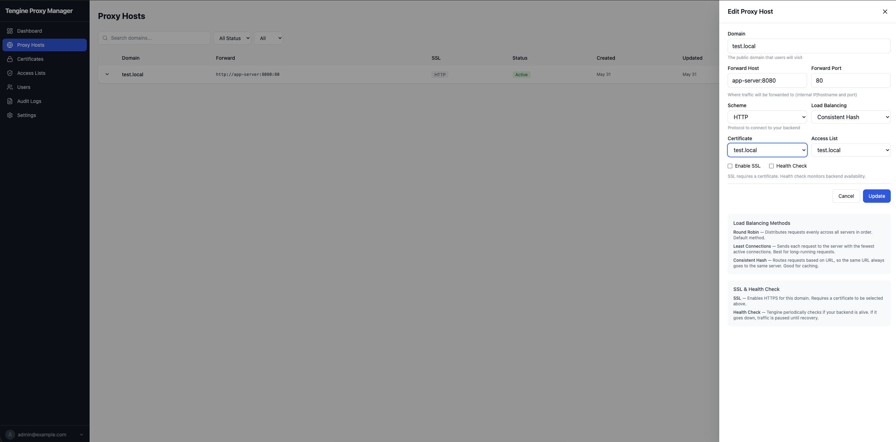
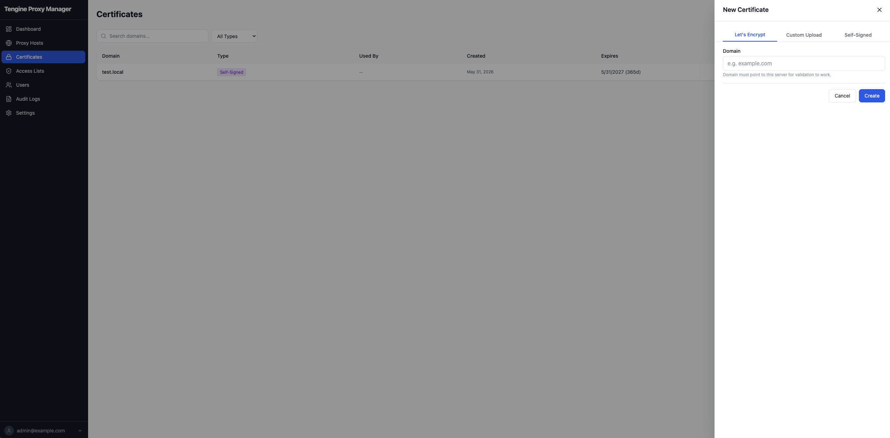
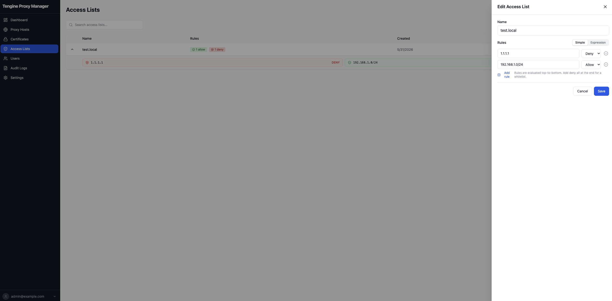
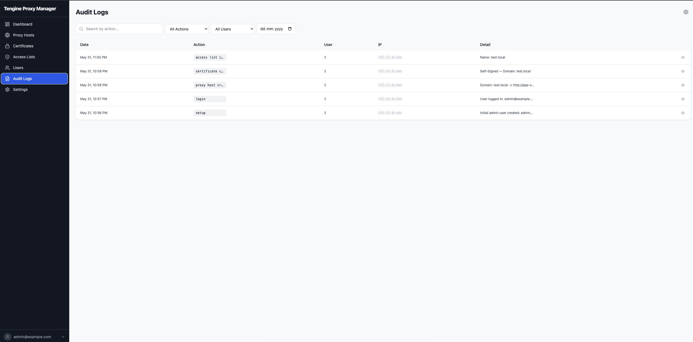
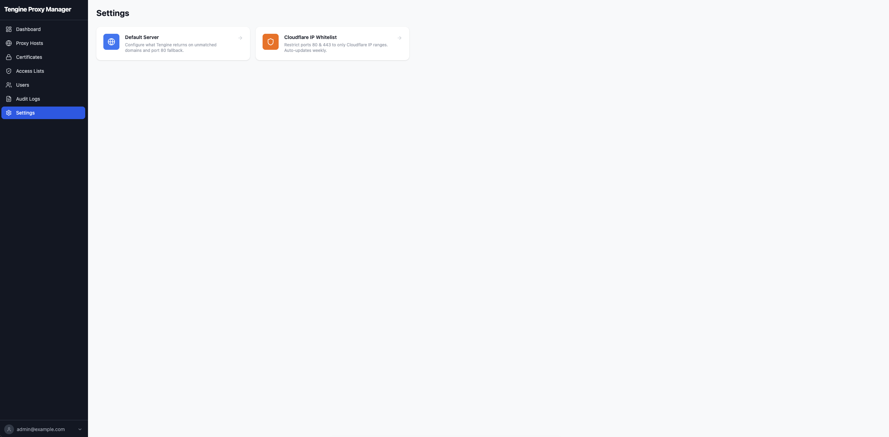
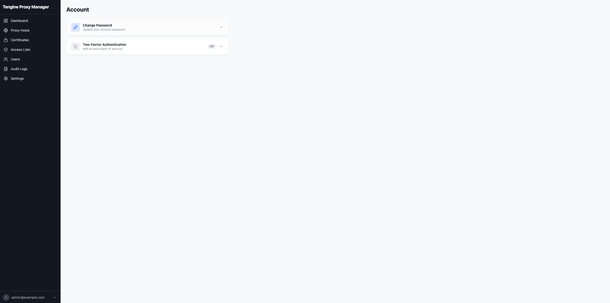
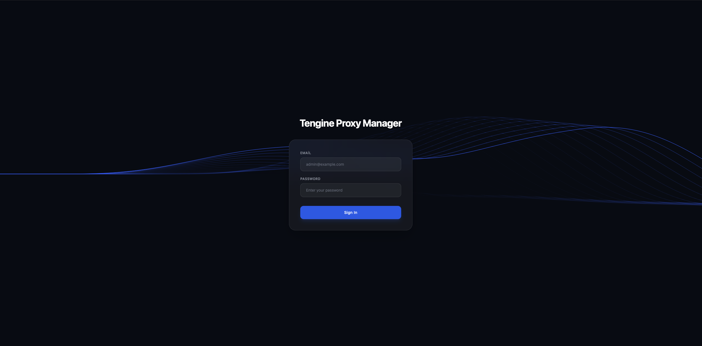

# Tengine Proxy Manager [](https://github.com/yusufgenc34/tengine-proxy-manager/releases)

Web-based management panel for [Tengine](https://github.com/alibaba/tengine), a high-performance web server forked from Nginx by Alibaba. Tengine adds dynamic module loading, advanced load balancing, and active health checks while maintaining full Nginx compatibility. Built with Go, React, and PostgreSQL.

> **Beta Notice:** This project is in active development. Features may change and bugs may exist. Feedback and contributions are welcome.

## Features

- **Proxy Host Management** — Create and manage reverse proxy entries with domain, forwarding rules, SSL, health checks, and load balancing
- **SSL Certificates** — Let's Encrypt automation, self-signed certs for local dev, custom certificate upload
- **Access Control** — IP/CIDR-based allow/deny lists with expression editor
- **Two-Factor Auth** — TOTP-based 2FA for admin accounts
- **Audit Logging** — Full audit trail with IP tracking, filters, and retention policy
- **Cloudflare IP Whitelist** — Auto-sync Cloudflare IP ranges for origin protection
- **Configurable Default Server** — Customize Tengine's fallback response on unmatched domains
- **Automatic Config Generation** — Tengine configs generated from templates and auto-reloaded
- **System Health Monitoring** — Health check endpoint with DB and disk status
- **Idle Session Timeout** — Auto-logout after 15 minutes of inactivity
- **Rate Limiting** — Login (10 req/min) and API (120 req/min) throttling

## Screenshots

| Setup | Dashboard | Proxy Hosts |
|---|---|---|
|  |  |  |

| Proxy Editor | Certificates | Access Lists |
|---|---|---|
|  |  |  |

| Audit Logs | System Settings | Account |
|---|---|---|
|  |  |  |

| Login |
|---|
|  |

## Tech Stack

| Layer    | Technology                      |
|----------|---------------------------------|
| Frontend | React 18, TypeScript, Tailwind, Zustand |
| Backend  | Go 1.25, Echo v4, GORM              |
| Database | PostgreSQL 16                   |
| Proxy    | Tengine 3.1                     |

---

## Quick Start (Production)

### Prerequisites

- Docker and Docker Compose v2
- A domain pointing to your server (for SSL)

### 1. Clone and Configure

```bash
git clone <repo-url> TengineProxyManager
cd TengineProxyManager

# Copy environment file and edit secrets
cp .env.example .env
```

Edit `.env` with **strong passwords**:

```env
DB_PASSWORD=generate_a_strong_password_here
JWT_SECRET=at_least_32_characters_random_string
```

### 2. Start Services

```bash
docker compose up -d
```

### 3. Initial Setup

1. Open **http://localhost:5173** in your browser
2. You'll see the setup screen — this means no admin user exists yet
3. Find the **setup key** in the backend logs:

   ```bash
   docker logs tengineproxymanager-backend-1 2>&1 | grep "SETUP KEY"
   ```

4. Enter your email, password, and setup key on the setup page
5. Log in and start configuring your proxy hosts

### 4. Access Points

| Service    | URL                          |
|------------|------------------------------|
| Frontend   | http://localhost:5173        |
| Backend    | http://localhost:4000        |
| Tengine    | http://localhost:80 / :443   |
| Health     | http://localhost:4000/api/v1/health |

---

## Development Setup

### Prerequisites

- Go 1.25+
- Node.js 20+
- PostgreSQL 16
- Docker and Docker Compose v2 (for Tengine and database)

### Option 1: Docker Compose Dev (Recommended)

```bash
# Start PostgreSQL and Tengine in Docker, hot-reload for backend + frontend
docker compose -f docker-compose.dev.yml up -d
```

This uses `air` for Go hot-reload and Vite for React HMR. Changes to `backend/` and `frontend/` are reflected instantly.

| Service    | URL                          |
|------------|------------------------------|
| Frontend   | http://localhost:5173        |
| Backend    | http://localhost:4000        |
| Tengine    | http://localhost:80          |
| PostgreSQL | localhost:5432 (DB: `tpm_dev`, User: `tpm`, Pass: `devpassword`) |

**Setup key** for dev:

```bash
docker logs tengineproxymanager-backend-1 2>&1 | grep "SETUP KEY"
```

### Option 2: Local Development

```bash
# Start only PostgreSQL and Tengine via Docker
docker compose up -d postgres tengine

# Backend (separate terminal)
cd backend
cp .env.example .env  # edit DB_HOST=localhost
go run ./cmd/server/

# Frontend (separate terminal)
cd frontend
npm install
npm run dev
```

Backend starts at `:4000`, frontend dev server at `:5173`.

### Option 3: One-Click Setup Script

```bash
chmod +x scripts/setup.sh
./scripts/setup.sh
```

Creates `.env` from example (if not exists), builds and starts all services.

---

## Resetting the System

To wipe everything and start from scratch:

```bash
# 1. Truncate all database tables
docker exec -it tengineproxymanager-postgres-1 psql -U tpm -d tpm_dev \
  -c "TRUNCATE TABLE audit_logs, users, proxy_hosts, certificates, access_lists, cloudflare_settings CASCADE;"

# 2. Remove setup key to generate a new one on restart
docker exec tengineproxymanager-backend-1 rm -f /app/setup.key

# 3. Restart backend
docker compose restart backend

# 4. Get the new setup key
docker logs tengineproxymanager-backend-1 2>&1 | grep "SETUP KEY"
```

After reset, the setup page appears again at http://localhost:5173 with a **new** setup key.

---

## Project Structure

```
├── frontend/               # React + Vite + Tailwind
│   ├── src/
│   │   ├── pages/          # Page components (Dashboard, ProxyHosts, etc.)
│   │   ├── components/     # Reusable UI (Sidebar, PasswordInput, etc.)
│   │   ├── store/          # Zustand state (auth store)
│   │   ├── hooks/          # Custom hooks (useIdleTimeout)
│   │   └── api/            # Axios client with token refresh interceptor
│   ├── nginx.conf          # Production nginx config (SPA routing + API proxy)
│   └── Dockerfile          # Multi-stage: Node build → Nginx serve
├── backend/                # Go + Echo + GORM
│   ├── cmd/server/         # Entry point (main.go)
│   ├── internal/
│   │   ├── handler/        # HTTP handlers (auth, proxy_hosts, certs, etc.)
│   │   ├── service/        # Business logic (Tengine config gen, Certbot, Audit)
│   │   ├── model/          # GORM models (User, ProxyHost, Certificate, etc.)
│   │   ├── middleware/     # JWT auth, rate limiter, security headers
│   │   └── database/       # Connection, auto-migration
│   └── templates/          # Tengine config templates
├── docker/
│   └── tengine/            # Tengine 3.1 Dockerfile + entrypoint
├── scripts/
│   ├── setup.sh            # One-click production setup
│   └── reload-tengine.sh   # Test and reload Tengine config
├── docker-compose.yml           # Production services
├── docker-compose.dev.yml       # Development with hot-reload
└── .env.example                 # Environment variable template
```

---

## Environment Variables

| Variable              | Description                          | Default            |
|-----------------------|--------------------------------------|--------------------|
| `DB_HOST`             | PostgreSQL host                      | postgres           |
| `DB_PORT`             | PostgreSQL port                      | 5432               |
| `DB_NAME`             | Database name                        | tpm                |
| `DB_USER`             | Database user                        | tpm                |
| `DB_PASSWORD`         | Database password (**required**)     | —                  |
| `JWT_SECRET`          | JWT signing secret (**required**)    | —                  |
| `AUDIT_RETENTION_DAYS`| Auto-cleanup age in days (0=disabled)| 30                 |
| `TENGINE_CONF_DIR`    | Tengine config directory             | /etc/tengine/conf.d|
| `CORS_ORIGINS`        | Extra CORS origins (comma-separated) | —                  |

---

## Security

| Feature                | Details                                  |
|------------------------|------------------------------------------|
| Password hashing       | bcrypt cost 12                           |
| Two-factor auth        | TOTP (Google Authenticator, Authy, etc.) |
| Access token lifetime  | 15 minutes                               |
| Refresh token lifetime | 7 days                                   |
| Idle timeout           | 15 minutes (mouse/keyboard activity)     |
| Rate limiting          | Login: 10/min, API: 120/min              |
| Security headers       | XSS protection, MIME sniffing, CSP       |

---

## Troubleshooting

### Backend won't start
```bash
docker logs tengineproxymanager-backend-1
```
Check that PostgreSQL is healthy and env variables are set.

### Setup key not found
The setup key is generated on first backend startup and printed to logs. If you lose it:
```bash
docker exec tengineproxymanager-backend-1 cat /app/setup.key
```

### Tengine config errors
```bash
docker exec tengineproxymanager-tengine-1 tengine -t
docker exec tengineproxymanager-tengine-1 cat /var/log/tengine/error.log
```

### Reset everything (volumes included)
```bash
docker compose down -v
docker compose up -d
```

---

## Contributing

Pull requests are welcome. For major changes, please open an issue first to discuss what you would like to change.

1. Fork the repo
2. Create a feature branch (`git checkout -b feature/amazing-feature`)
3. Commit your changes (`git commit -m "Add amazing feature"`)
4. Push to the branch (`git push origin feature/amazing-feature`)
5. Open a Pull Request

## License

[MIT](LICENSE)
